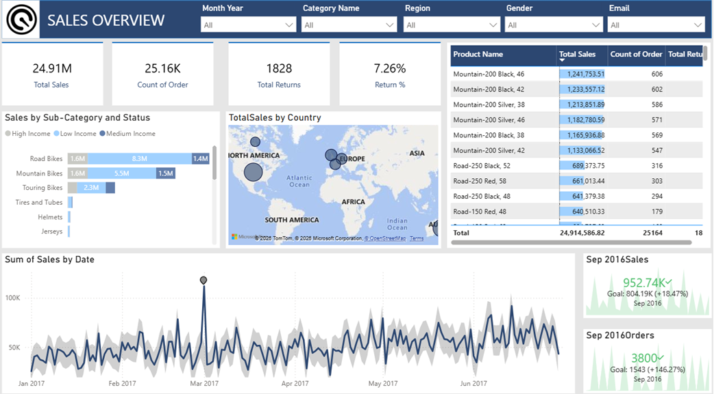
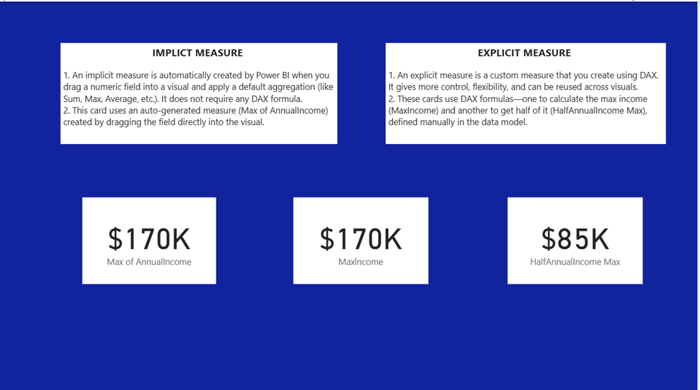

# 📊 Power BI Sales Dashboard

## 📌 Project Overview

This project is an interactive Sales Performance Dashboard developed using Microsoft Power BI. The dashboard helps analyze sales performance through KPIs, charts, filters, and DAX calculations.

---

## 🎯 Objectives

- Monitor overall sales performance
- Analyze product-wise sales
- Track customer insights
- Perform interactive data analysis
- Demonstrate DAX calculations and Power Query transformations

---

## 🛠️ Tools & Technologies

- Microsoft Power BI
- Power Query
- DAX
- Data Modeling

---

## 📷 Dashboard Screenshots

### 1. Overview

---

### 2. Product Details

---

### 3. DAX Dashboard

---

## 💼 Skills Demonstrated

- Dashboard Development
- KPI Reporting
- Data Visualization
- Power Query
- DAX Functions
- Business Intelligence
- Data Modeling

---

## 👩‍💻 Author

**Janvi Bisen**

Aspiring Data Analyst | Power BI | SQL | Python | Healthcare Analytics
